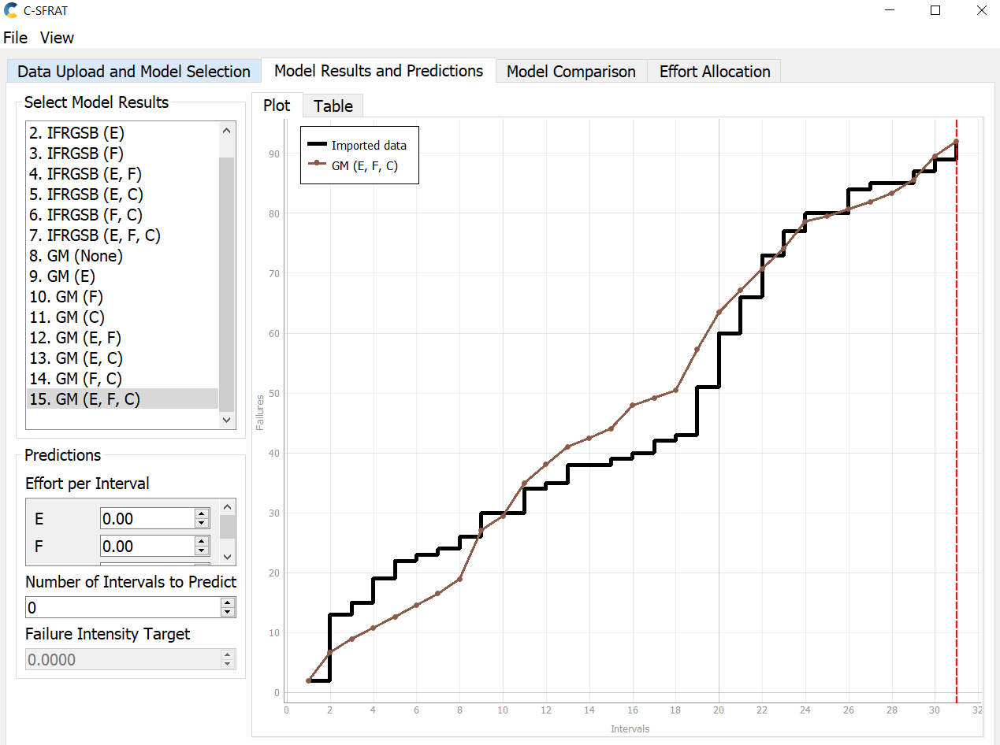
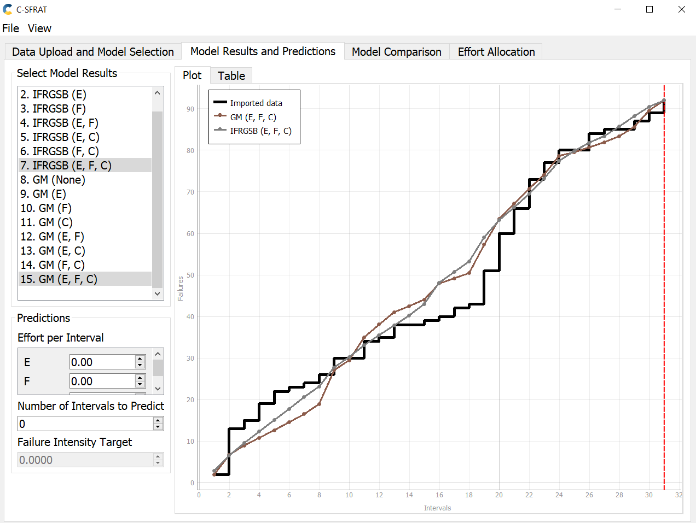
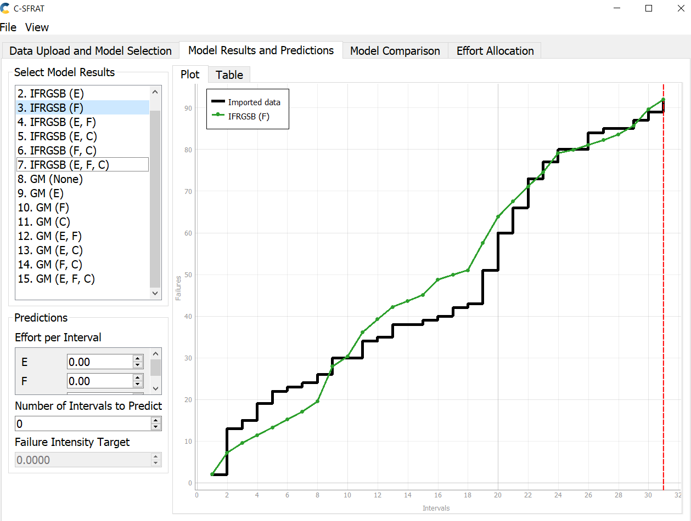
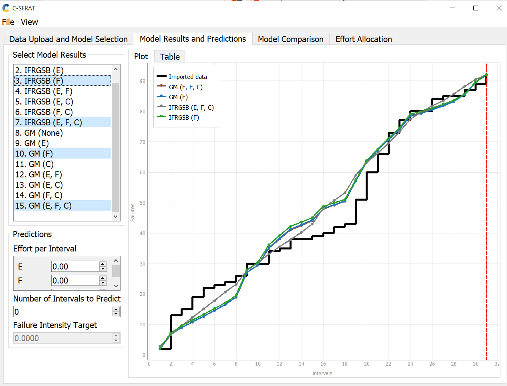
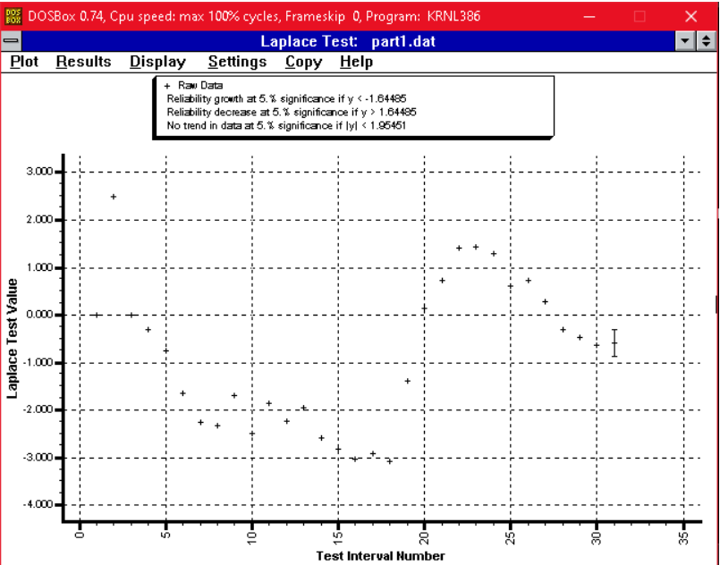
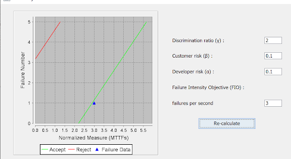
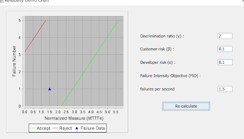
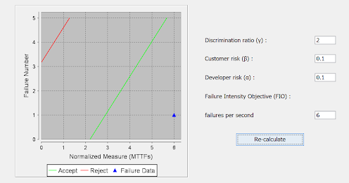

<!-- Output copied to clipboard! -->

<!-----

Yay, no errors, warnings, or alerts!

Conversion time: 0.449 seconds.

Using this Markdown file:

1. Paste this output into your source file.
2. See the notes and action items below regarding this conversion run.
3. Check the rendered output (headings, lists, code blocks, tables) for proper
   formatting and use a linkchecker before you publish this page.

Conversion notes:

* Docs to Markdown version 1.0β33
* Fri Apr 08 2022 15:24:34 GMT-0700 (PDT)
* Source doc: SENG 438 Assignment 1 Report
* Tables are currently converted to HTML tables.

WARNING:
You have 5 H1 headings. You may want to use the "H1 -> H2" option to demote all headings by one level.

----->

>>>>>  gd2md-html alert:  ERRORs: 0; WARNINGs: 1; ALERTS: 0.

<ul style="color: red; font-weight: bold"><li>See top comment block for details on ERRORs and WARNINGs. <li>In the converted Markdown or HTML, search for inline alerts that start with >>>>>  gd2md-html alert:  for specific instances that need correction.</ul>

Links to alert messages:

>>>>> PLEASE check and correct alert issues and delete this message and the inline alerts.

**SENG 438 Assignment 5 Report	**

**Group: (18)**

<table>
  <tr>
   <td>
    Sr.
   </td>
   <td>
    Name
   </td>
   <td>
    UCID
   </td>
  </tr>
  <tr>
   <td>
    1.
   </td>
   <td>
    Ali Siddiqi
   </td>
   <td>
    30092156
   </td>
  </tr>
  <tr>
   <td>
    2.
   </td>
   <td>
    Jay Gurjar
   </td>
   <td>
    30096042
   </td>
  </tr>
  <tr>
   <td>
    3.
   </td>
   <td>
    Kai Wang
   </td>
   <td>
    30002810
   </td>
  </tr>
  <tr>
   <td>
    4.
   </td>
   <td>
    Mohamed Numan
   </td>
   <td>
    30086940
   </td>
  </tr>
</table>

**SENG 438 GROUP**

**Introduction**

In the lab we analyzed the given test data through the tools such as C-SFRAT  and the excel sheet. We will be assessing failure reliability growth testing and a reliability demonstration chart. As a team, we decided to use C-SFRAT as it provided a much simpler user interface to analyze the sample failure data provided.

**Assessment Using Reliability Growth Testing**

Using the tool C-SFRAT allowed us to compare the various models with the Model Comparison feature where we could view how each model fits with the failure data. We could decide upon the best model by checking which line is the closest to the failure data input we provide. Also, the chart displays the correspondence between failure data and the best model that uses the geometric sequence to closely track the data. From this, it shows the models Geometric and IFR sequence models closely model the failure data when it is calculated with respect to the three parameters.

C-SFRAT was used to obtain the figure above. This was done by modeling the data which best fitted the parameters provided to depict the failure data. The figure above shows the relation between Geometric and IFR models between intervals of 2 to 10 and 22 to 26. In the upper interval, IFRGSB tracks the data better compared to Geometric while Geometric tracks data better compared to the IFRGSB model in the lower data interval. This shows different models perform better for different intervals. On top of that, this also showcases why we need to include all three parameters in order to get the models that most accurately depict the failure data provided.

The figure models the data failure rate of the chosen models(IFRGSB and Geometric) using the time between the intervals as the parameter. This parameter models the data failure rate the best given the parameters we set.

We choose to use Geometric and IFRGSB as the models to pursue since those gave us the closest visual depiction of the failure data we were provided. This data was also graphed in C-SFRAT. We can observe that the models are more accurate on higher data intervals compared to lower intervals.

This graph reflects the trends from all three parameters. The observed trend is followed as the models are more accurate for higher time intervals. The models do not reflect the failure data at the lower data interval. But the models are decently accurate in intervals 8-14.

The model on top of reflecting the discrepancy of failure data depiction, also shows us why choosing all three parameters would be the best parameters to choose. Furthermore, this also shows why Geometric is a better model to use compared to IFRGSB on lower time frames and why IFRGSB is a better model to use on a higher timeframe. This graph confirms that the models we choose are accurate as they model the failure data is reflected more clearly.

We conducted a Laplace test on the failure data. This gave us more insight into how reliability growth is significant for values of y. Therefore, the graph plotted below confirms our assumption of having an accurate model from 8 to 14.

An advantage of reliability growth analysis is that it can be used to predict potential failures in the future. This can lead to saving more money on fixing these bugs later in the development process or after the software has been developed. And this, therefore, helps us predict how accurate the system is over time. 

# **Assessment Using Reliability Demonstration Chart**

Mentioning the RDC1 figure in the RDC folder. Using a developer and customer risk tolerance of 1 failure for every 10 seconds and also a discrimination ratio of 2, so then the system will get accepted with a Failure Intensity object of 3 failures per second. So the customer and developer need the program to have a max of 1 failure for every 10 seconds.

The purpose of the discrimination ratio is to show the quantity of error the calculation accepts and correlates to the area between the acceptance and rejection lines. To be acceptable for developers and customers the software must achieve a  Failure Intensity object of at least 3 failures per second which would be satisfactory.

RDC2 figure shows that making Failure Intensity object (FIO) when FIO is halved. Failure data reset in the continue part of the graph shows that the FIO data does not pass or fail the risk requirements. Instead, is undetermined because of the permissible error created by the discrimination ratio. For instance, reducing the discrimination ratio, failure data will be rejected in that scenario. 

The RDC3 figure reflects what happens when FIO is increased by 2 times its original. FIO is 6 so it causes the failure data that is a lot more than the acceptance rate. FIO of 6 definitely more than meets the customer and developer requirements. 

# **Comparison of Results**

Part one's data plots allow for an approximate estimation of FIO. The plots with the least failure are at 0 intervals which are expected; furthermore, the majority of failures are present at the final interval. Given this data, the slope of linear failure intensity is 3.2 = 95/30 which provides an approximate idea of the minimum FICO needed for the acceptance of failure data.

We choose the 30th interval since 95 failures are found at the 30th interval which roughly shows the minimum failure intensity objective to ensure the failure data is accepted. In part 2, we calculated the minimum failure intensity objective to accept the failure data was 3, so the result from part 1 which was 3.2 is very close.  Estimation as the approximation included for part 1 is linear and the region in the interval is 18-20. So overall that was our main conclusion drawn from comparing the results.

# **Discussion on Similarity and Differences of the Two Techniques**

It was interesting using the different techniques and the differences between them. Both techniques are different but analyze the failure rates of data provided visually with reference to the expected values. Reliability growth testing allowed us to visualize the entire dataset over the given time range while Reliability Demonstration Chart only allowed us to compare certainly accepted and rejected conditions. 

The Reliability Demonstration Chart is more about showcasing the system’s reliability while Reliability Growth Testing allows us to increase system reliability and shows us where the system lacks overall. Using the different techniques also for a more holistic understanding of the problem and improve on different areas together. 

# **Difficulties encountered, challenges overcome, and lessons learned**

SRTAT and the excel sheet were not working as described by the lab handout so C-SFRAT had to be used for part one of the lab. Also, it was not clear what needed to be done in the lab too. The RDC spreadsheet was initially difficult to use and understand such as requiring editing privilege to make modifications to the spreadsheet. After reading the instructions it became a lot easier to use the RDC program.

# **Comments/feedback on the lab itself**

The lab was difficult because the resources mentioned were not working as described by the lab manual. SRTAT not working easily with the csv file provided the program failed to run properly. Also the lack of lab instructions given made the lab hard to do as there was little direction. In the future please include a few more screenshots of the C-SFRAT itself as well as RDC. 

**Teamwork/effort division:**

We decided that half of us would work on part 1 while the other half on part2 so we ended up with a fair division of work. Each team later checked on each other to ensure the other team's parts were satisfactory and we also asked each other questions throughout the process. 
